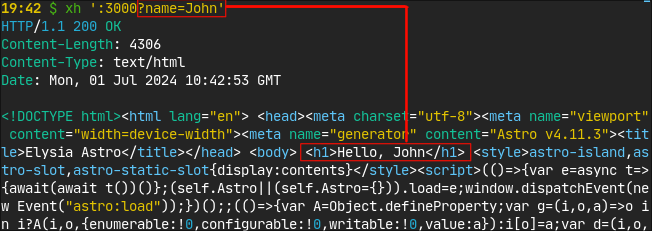
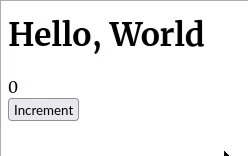

# React Server + Client Component on Elysia

This is an example or proof of concept of full-stack
[Elysia](https://github.com/elysiajs/elysia) application with both **Server-Side
Rendering** (SSR) capability and **client-side interactivity**. It integrates
React via [Astro](https://astro.build/), but it can also incorporate any other
UI library (e.g. Vue.js, Svelte, Solid, etc.) that [Astro
supports](https://docs.astro.build/en/guides/integrations-guide/#official-integrations).

This is **not Elysia on Astro** (that is, an Elysia endpoint added to the
file-based routing hierarchy of Astro). It is **Astro islands on Elysia**, which
is made possible thank to the experimental [Container
API](https://docs.astro.build/en/reference/container-reference/) available since
[Astro 4.09](https://astro.build/blog/astro-490/). Instead of the file-based
routing, you will use Elysia to define routes, where you can use
[Typebox](https://github.com/sinclairzx81/typebox) to validate query parameters,
cookies, and form data. Most of the server-side work is done in Elysia, and you
need to know a little knowledge about Astro, such as [client
directives](https://docs.astro.build/en/reference/directives-reference/#client-directives)
for components.

Elysia + Astro Containers is a simpler alternative to
[Next.js](https://nextjs.org/), [Remix](https://remix.run/),
[HonoX](https://github.com/honojs/honox), [Vike](https://vike.dev/), etc. This
would be more suitable for small but highly interactive web applications that
have more API endpoints than page types.

## Demo

A dynamic content (from the query parameter) is rendered on the server side:



The component is interactive on the client side:



## How to run the application on your machine

You need [Bun](https://bun.sh/) to run this demo application.

First install the dependencies:

``` bash
bun install
```

Build the Astro components:

``` bash
bun run build:astro
```

Start the development server for Elysia:

``` bash
bun run dev:elysia
```

Once the server has started, open http://localhost:3000/.

Alternatively, you can run `bun run dev` to build the component and start the
server with a single command.

## Credits

Part of the Astro code is based on [astro-in-php-example](https://github.com/matthewp/astro-in-php-example) by [Matthew Phillips](https://github.com/matthewp/) (@matthewp).
